# Axios Lab - Next.js Application

This is a [Next.js](https://nextjs.org) project bootstrapped with [`create-next-app`](https://nextjs.org/docs/app/api-reference/cli/create-next-app).

## 📁 Project File Structure

```mermaid
graph TD
    A[axios-lab] --> B[app/]
    A --> C[components/]
    A --> D[lib/]
    A --> E[public/]
    A --> F[Configuration Files]
    
    B --> B1[api/]
    B --> B2[dashboard/]
    B --> B3[login/]
    B --> B4[signup/]
    B --> B5[page.tsx]
    B --> B6[layout.tsx]
    B --> B7[globals.css]
    B --> B8[favicon.ico]
    
    B2 --> B2A[finance/]
    B2 --> B2B[fundraising/]
    B2 --> B2C[marketing/]
    B2 --> B2D[plugins/]
    B2 --> B2E[recruitment/]
    B2 --> B2F[tasks/]
    B2 --> B2G[page.tsx]
    B2 --> B2H[layout.tsx]
    
    C --> C1[layout/]
    C --> C2[ui/]
    
    C1 --> C1A[header.tsx]
    C1 --> C1B[sidebar.tsx]
    C1 --> C1C[shell.tsx]
    
    C2 --> C2A[button.tsx]
    C2 --> C2B[card.tsx]
    C2 --> C2C[dropdown-menu.tsx]
    C2 --> C2D[input.tsx]
    
    D --> D1[ai.ts]
    D --> D2[auth.ts]
    D --> D3[mock-data.ts]
    D --> D4[theme-provider.tsx]
    D --> D5[types.ts]
    D --> D6[users.ts]
    D --> D7[utils.ts]
    
    E --> E1[axios-logo.png]
    E --> E2[SVG Assets]
    
    F --> F1[package.json]
    F --> F2[tsconfig.json]
    F --> F3[next.config.ts]
    F --> F4[.env.local]
    F --> F5[middleware.ts]
    
    style A fill:#4F46E5,stroke:#333,stroke-width:3px,color:#fff
    style B fill:#10B981,stroke:#333,stroke-width:2px,color:#fff
    style C fill:#F59E0B,stroke:#333,stroke-width:2px,color:#fff
    style D fill:#EF4444,stroke:#333,stroke-width:2px,color:#fff
    style E fill:#8B5CF6,stroke:#333,stroke-width:2px,color:#fff
    style F fill:#6366F1,stroke:#333,stroke-width:2px,color:#fff
```



## 📂 Directory Structure Overview

### `/app` - Application Routes & Pages
- **`api/`** - API route handlers
- **`dashboard/`** - Main dashboard with multiple modules:
  - `finance/` - Financial management
  - `fundraising/` - Fundraising features
  - `marketing/` - Marketing tools
  - `plugins/` - Plugin integrations
  - `recruitment/` - Recruitment management
  - `tasks/` - Task management
- **`login/`** - Authentication login page
- **`signup/`** - User registration page
- **`page.tsx`** - Root landing page
- **`layout.tsx`** - Root layout wrapper
- **`globals.css`** - Global styles

### `/components` - Reusable UI Components
- **`layout/`** - Layout components:
  - `header.tsx` - Application header
  - `sidebar.tsx` - Navigation sidebar
  - `shell.tsx` - Page shell wrapper
- **`ui/`** - UI primitives:
  - `button.tsx` - Button component
  - `card.tsx` - Card component
  - `dropdown-menu.tsx` - Dropdown menu
  - `input.tsx` - Input field component

### `/lib` - Utility Libraries & Business Logic
- **`ai.ts`** - AI integration utilities
- **`auth.ts`** - Authentication logic
- **`mock-data.ts`** - Mock data for development
- **`theme-provider.tsx`** - Theme management
- **`types.ts`** - TypeScript type definitions
- **`users.ts`** - User management utilities
- **`utils.ts`** - General utility functions

### `/public` - Static Assets
- **`axios-logo.png`** - Application logo
- SVG icons and images

### Configuration Files
- **`package.json`** - Dependencies and scripts
- **`tsconfig.json`** - TypeScript configuration
- **`next.config.ts`** - Next.js configuration
- **`.env.local`** - Environment variables
- **`middleware.ts`** - Next.js middleware

## 🚀 Getting Started

First, run the development server:

```bash
npm run dev
# or
yarn dev
# or
pnpm dev
# or
bun dev
```

Open [http://localhost:3000](http://localhost:3000) with your browser to see the result.

You can start editing the page by modifying `app/page.tsx`. The page auto-updates as you edit the file.

This project uses [`next/font`](https://nextjs.org/docs/app/building-your-application/optimizing/fonts) to automatically optimize and load [Geist](https://vercel.com/font), a new font family for Vercel.

## 📚 Learn More

To learn more about Next.js, take a look at the following resources:

- [Next.js Documentation](https://nextjs.org/docs) - learn about Next.js features and API.
- [Learn Next.js](https://nextjs.org/learn) - an interactive Next.js tutorial.

You can check out [the Next.js GitHub repository](https://github.com/vercel/next.js) - your feedback and contributions are welcome!

## 🚢 Deploy on Vercel

The easiest way to deploy your Next.js app is to use the [Vercel Platform](https://vercel.com/new?utm_medium=default-template&filter=next.js&utm_source=create-next-app&utm_campaign=create-next-app-readme) from the creators of Next.js.

Check out our [Next.js deployment documentation](https://nextjs.org/docs/app/building-your-application/deploying) for more details.
